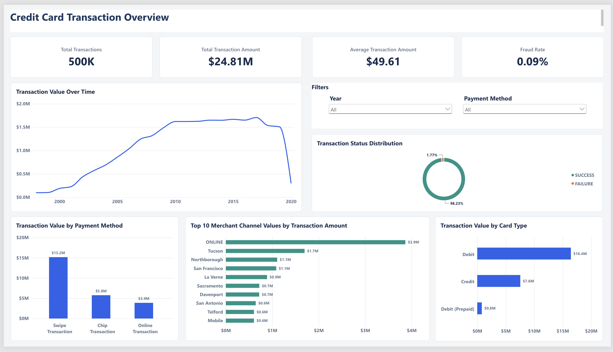
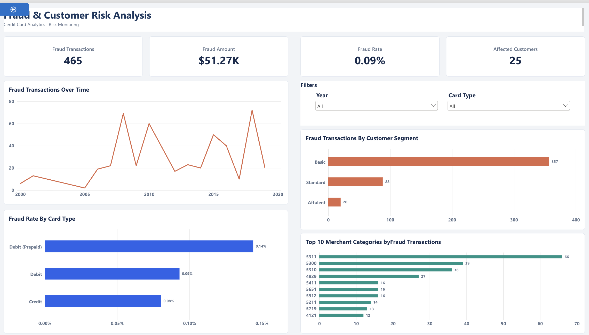

# Credit Card Data Engineering | Batch & Streaming

End-to-end data engineering portfolio project using **Databricks, PySpark, Delta Lake, SQL, Airflow, Kafka, Spark Structured Streaming, and Power BI**.

## Architecture

**Batch analytics:** Raw CSV → Databricks Bronze → PySpark Silver → Delta Gold (star schema) → Power BI

**Streaming prototype (separate):** Python Producer → Kafka → Spark Structured Streaming → Parquet + Checkpoint

> The **499,996 historical transactions** were processed in the batch pipeline. Kafka processes separately generated mock events.

## Data Pipeline

- **Bronze:** Ingest transaction, customer, and card CSV datasets.
- **Silver:** Clean, standardize, derive attributes, and validate records.
- **Gold:** Build `fact_transactions` and four dimensions: `dim_customers`, `dim_cards`, `dim_date`, `dim_merchant`.
- **Power BI:** Connect the Gold tables through a star-schema semantic model with four active dimension-to-fact relationships.

## Power BI Dashboards

**Transaction Overview:** Transaction volume and value, trends, payment methods, merchant channels, card types, and interactive slicers.

**Fraud & Customer Risk:** Fraud volume and value, affected customers, trends, customer segments, card-type risk, and interactive slicers.

Report: [`powerbi/Credit_Card_Analytics.pbix`](powerbi/Credit_Card_Analytics.pbix) — **publish only if its embedded data is safe to share**.

## Validated Results

| Metric | Result |
| --- | ---: |
| Transactions | **499,996** |
| Transaction amount | **$24,806,889.57** |
| Average transaction | **$49.61** |
| Fraud transactions | **465** |
| Fraud rate | **0.09%** |
| Fraud amount | **$51,273.54** |
| Affected customers | **25** |

All seven metrics were reconciled between Databricks SQL and Power BI.

## Streaming & Orchestration

- **Kafka:** Docker-based broker, `credit_card_transactions` topic with **3 partitions**, Python JSON event producer.
- **Spark Structured Streaming:** Parse and transform events; write Parquet output with checkpointing.
- **Airflow:** Practiced DAG dependencies and execution in GitHub Codespaces; these DAGs are **not** claimed to trigger the Databricks batch pipeline.

## Project Files

- `kafka/` — Kafka setup, producer, and Spark streaming code
- `airflow/` — Airflow DAGs
- `powerbi/` — PBIX report and dashboard screenshots

**Data-sharing note:** Check the PBIX and repository history for customer names, addresses, card numbers, CVVs, or other restricted data before making the repository public.
